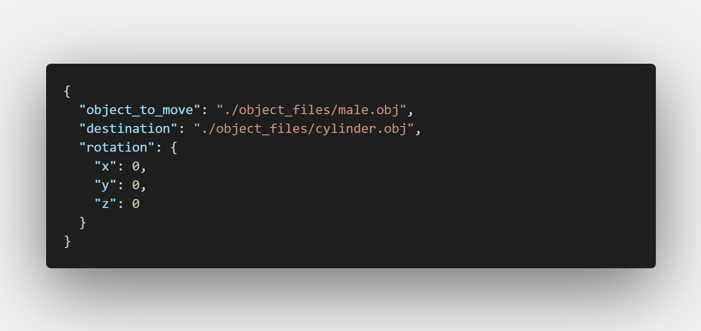
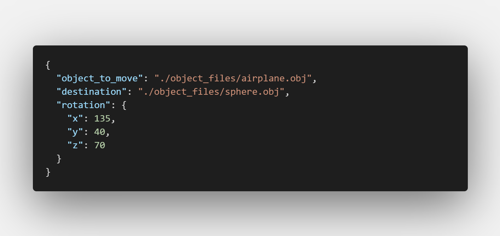
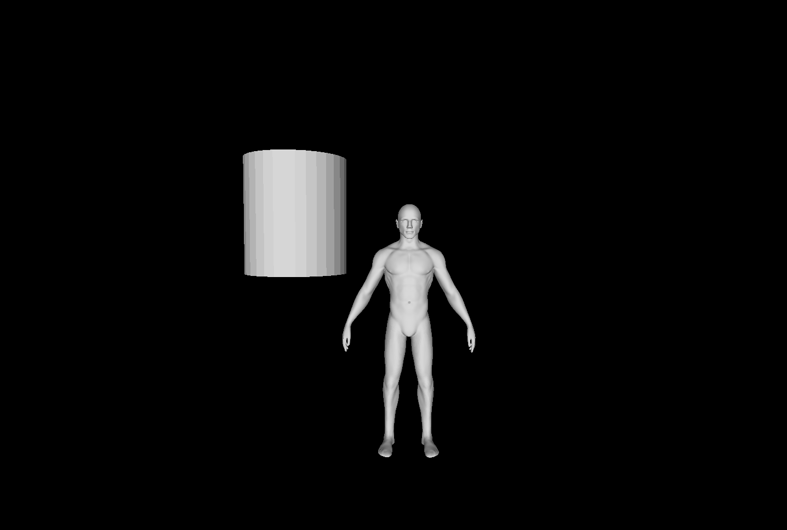
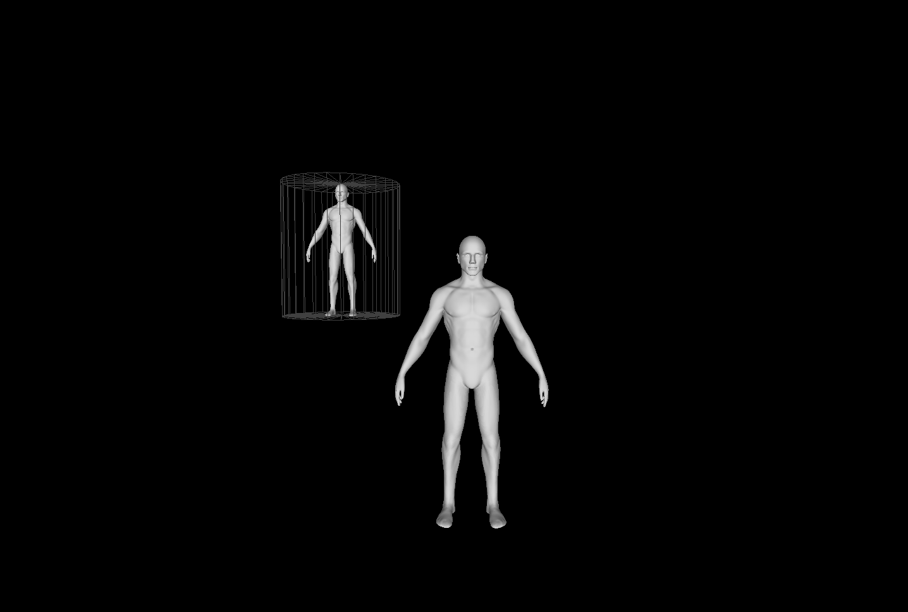
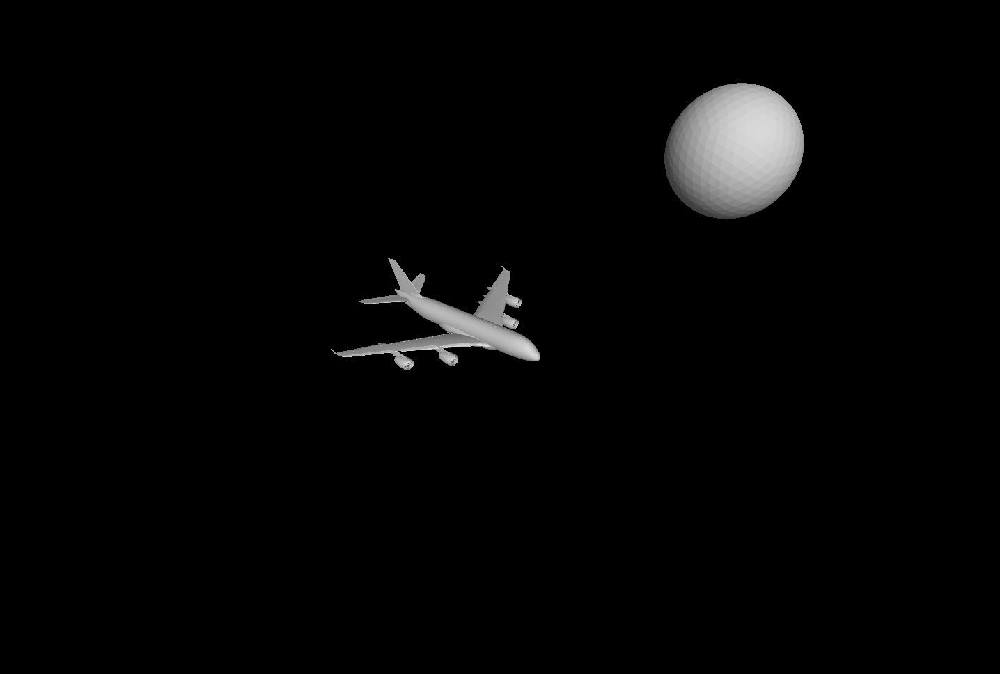
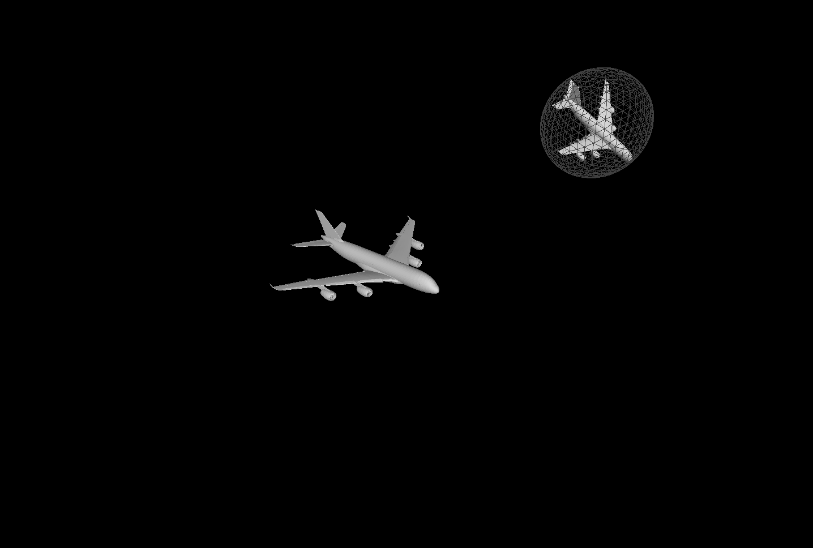

# This is a repo for my thesis project

## Topic

Python tool for '.obj' files transformation and manipulation:

- It does uniform scaling so objects can be fitted into destination objects and not be distorted.
- Moves the objects in the center of the destination object so it is aligned.
- Optionally rotates the object if specified in the config file.

## Usage

````bash
python tool.py log_file.json
````

The results are saved in directory `patched/` with the name `<object_to_move>_moved.obj`.

## Example

````bash
python tool.py log_files/log1.json
````

## Requirements

- Python 3.8+

## Functionality

- Computes the bounding box and center of both objects.
- Computes the scale factor needed to fit the object into the destination object.
- Applies the scale factor to the object.
- Moves the object to the center of the destination object.
- Optionally rotates the object if a rotation is specified in the config file.
- Saves the transformed object in the `patched/` directory.

## Output

- Correct scale and position of the object.
- Position in the correct center of the destination object.
- 3d object is saved in the `patched/` directory with the name `<object_to_move>_moved.obj`.

## Example Input

Here is an example of a log file that specifies the object to move, the destination object, we do not have rotation in this example:


OR



If we want to rotate the object, we can specify the rotation in the log file (in degrees):



## Example Output

Firstly we want to test the transformation of an object. So we just want to move this male figure into a cube but not to rotate it.


We can see that the object is centered and in bounds of the destination object.


Now another example with rotation. We want to move the airplane into a sphere and rotate it.


We can see that the object is centered and in bounds of the destination object.


You can find the whole analytical thesis report .
